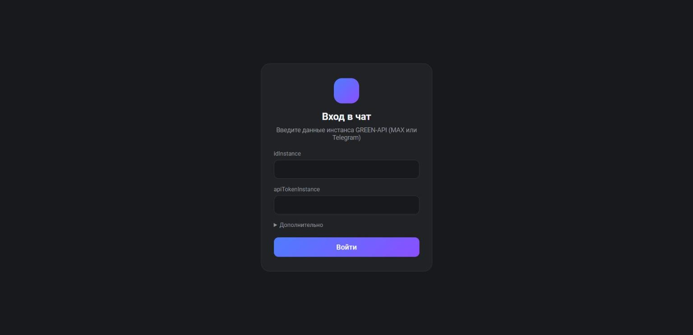
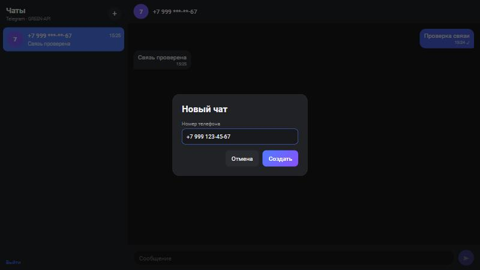
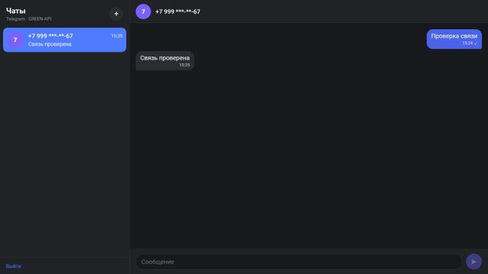

# MAX Chat — тестовое задание (Фронтенд разработчик React)

Веб-чат для отправки и получения текстовых сообщений через [GREEN-API](https://green-api.com/max).
Работает с инстансами MAX и Telegram (у них общий API v3). Внешний вид ориентирован на [web.max.ru](https://web.max.ru/).

Стек: React 19, TypeScript, Vite, Vitest. Без UI-библиотек и без бэкенда: браузер обращается к GREEN-API напрямую (сервис отдаёт CORS-заголовки для GET, POST и DELETE).

**Демо:** https://suren4ik.github.io/green-api-max-chat/ (собирается и публикуется GitHub Actions при каждом push в `main`).

## Скриншоты

| Вход | Новый чат | Переписка |
|---|---|---|
|  |  |  |

## Запуск локально

Нужен Node.js 20+.

```bash
git clone https://github.com/Suren4ik/green-api-max-chat.git
cd green-api-max-chat
npm install
npm run dev      # http://localhost:5173
```

Прочие команды: `npm test` (юнит-тесты), `npm run lint`, `npm run build` (сборка в `dist/`), `npm run preview`.

## Как пользоваться

1. В [личном кабинете GREEN-API](https://console.green-api.com/) создайте инстанс MAX (или Telegram) и авторизуйте его.
2. Откройте приложение и введите `idInstance` и `apiTokenInstance`. Адрес API определяется автоматически по первым 4 цифрам `idInstance` (например, `https://4100.api.green-api.com`); поле «Адрес API» в разделе «Дополнительно» нужно только для нестандартного хоста.
3. Если в настройках инстанса выключено получение входящих или задан `webhookUrl`, приложение покажет предупреждение и кнопку «Включить приём входящих» (`setSettings`). GREEN-API применяет настройки в течение 5 минут.
4. Нажмите «+», введите номер получателя (`79991234567` или `8 999 123-45-67`). Номер проверяется методом `checkAccount`, после чего создаётся чат.
5. Напишите сообщение (Enter — отправить, Shift+Enter — перенос строки). Ответы появляются в чате автоматически; сообщения от новых собеседников создают новые чаты.

## Используемые методы GREEN-API

| Назначение | Метод |
|---|---|
| Проверка данных при входе | `GET getStateInstance` (вход разрешён только в состоянии `authorized`) |
| Проверка и исправление настроек приёма | `GET getSettings`, `POST setSettings` |
| Номер телефона → chatId | `POST checkAccount` |
| Отправка | `POST sendMessage` |
| Получение | `GET receiveNotification` (long polling, 20 с) → `DELETE deleteNotification/{token}/{receiptId}` |

## Структура

```
src/
  api/greenApi.ts            клиент GREEN-API: адреса по документации, типы, понятные ошибки
  hooks/useNotifications.ts  проверка настроек и цикл приёма: receive → обработка → delete
  store/chatStore.ts         reducer чатов и сообщений, localStorage, синхронизация вкладок
  components/                LoginForm, Sidebar, ChatWindow, NewChatDialog, ChatApp
  *.test.ts                  юнит-тесты (адреса API, разбор уведомлений, reducer, слияние вкладок)
```

## Детали реализации

- Исходящее сообщение сразу появляется в чате со статусом «отправляется», затем «отправлено» (✓). При ошибке показывается кнопка «Повторить».
- Каждое уведомление подтверждается `deleteNotification`, включая нетекстовые, иначе очередь встанет. Дубли входящих отсекаются по `idMessage`. Вложения показываются заглушкой: по заданию поддерживается только текст.
- Ответ `408` у `receiveNotification` — штатный «новых уведомлений нет». Ошибки `429` и `5xx` (GREEN-API эпизодически отвечает `503`) повторяются с экспоненциальной паузой до 30 с.
- Очередь уведомлений у инстанса одна, поэтому опрашивает её только одна вкладка (Web Locks API). Остальные получают сообщения через событие `storage`; состояния вкладок сливаются по id, так что одновременная запись ничего не теряет.
- Если входящее пришло с `chatId`, отличным от полученного через `checkAccount`, сообщение попадает в чат по номеру отправителя (`senderPhoneNumber`).
- Внизу списка чатов — статус приёма (работает / ошибка / идёт в другой вкладке) и счётчик полученных уведомлений; каждое уведомление пишется в консоль (`console.debug`).
- Чаты и переписка хранятся в `localStorage` отдельно для каждого `idInstance`. Учётные данные тоже лежат в `localStorage`, пока вы не нажмёте «Выйти». Для тестового проекта без бэкенда это допустимо, для продакшена нужен серверный прокси.
